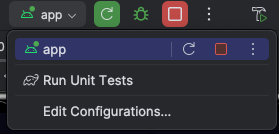
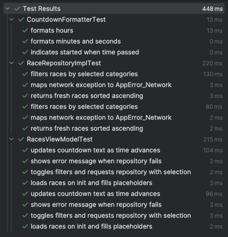

# ENTAIN - NextRaces

NextRaces is for the Interview at Entain - it's an app that displays the next five racing events from Entain's public API !   

It embraces a multi modular stack with Compose to deliver a polished, accessible UI.

## Highlights
- Jetpack Compose UI with Material 3 theming, dark mode, and font scaling support.
- My Compose 1.9.0 `animateItem` use that makes cards appear, switch, and disappear in one fluid sweep with really cool easing functions—these animations feel incredible in motion.
- Multimodule architecture that cleanly separates UI, feature, data, network, and shared utilities.
- Reactive data loading with auto-refresh (15s) and live countdowns per race.
- Filter chips for horse, harness, and greyhound racing with the ability to show the next five across all categories.
- Graceful error handling, offline resilience (retains last good data), and placeholder items when data is sparse.
- Unit tests covering core domain logic (repository filtering, countdown formatting, ViewModel behaviour).

## Module Overview

| Module | Responsibility |
| ------ | -------------- |
| `app` | Application entry point, Hilt setup, and tying theming to the feature module. |
| `feature:races` | Race listing screen, ViewModel, UI state, and filter orchestration. |
| `core:data` | Repository implementation, data orchestration, DI bindings. |
| `core:network` | Retrofit service, networking configuration, API DTOs. |
| `core:model` | Domain models and racing category constants. |
| `core:common` | Shared utilities (result wrapper, dispatcher provider, time helpers, countdown formatting). |
| `core:designsystem` | Material 3 theme wrapper and reusable UI primitives. |
| `core:testing` | Common test utilities (dispatcher rule, controllable clock). |

## Demo
Watch the walkthrough (recorded on device):
- [`docs/media/next-races-demo.webm`](docs/media/next-races-demo.webm)

## Tech Stack
- **Language:** Kotlin 2.2.21 (Compose compiler plugin aligned)
- **UI:** Jetpack Compose BOM 2025.11.00 with Material 3 v1.4.0 and Compose 1.9 `animateItem`
- **Async:** Coroutines & Flow 1.10.2
- **DI:** Hilt 2.54
- **Networking:** Retrofit 3.0.0 + Kotlinx Serialization 1.6.3 + OkHttp 5.3.0
- **Date/Time:** Kotlinx.datetime 0.5.0
- **Testing:** JUnit4, Turbine 1.0.0, coroutines-test 1.10.2, Truth 1.1.5, MockK 1.13.10

## Requirements
- Android Studio Otter | 2025.1 or newer
- JDK 17
- Android SDK 35

## Build & Run
```bash
./gradlew app:assembleDebug
```
Deploy the generated debug APK or run the `app` configuration from Android Studio.

## Android Studio Run Configurations

- `App` launches the debug build straight from Android Studio, deploying to your selected emulator or device with the Hilt DI graph fully wired.
- `All Unit Tests` wraps `./gradlew test`, so a single click runs repository, ViewModel, and supporting module tests without leaving the IDE.

## Testing
```bash
./gradlew test
```
This executes unit tests across all modules, including repository logic, countdown formatting, and ViewModel behaviour.

## Requirement Coverage

### User Stories
- Time-ordered races: the repository sorts every response by advertised start before mapping to UI, so the list stays ascending.
- Hide stale races: anything more than one minute past start is filtered via `STALE_RACE_THRESHOLD` before it reaches the screen.
- Category filters: horse, harness, and greyhound chips drive a filter set that is passed to the repository when toggled.
- Clear filters to show all: the All chip resets the filter set, returning the unified feed.
- Always five races with refresh: `MAX_RACES_DISPLAY` is 5, placeholders backfill gaps, and a 15s ticker keeps data refreshed.
- Rich race cards: each card renders meeting name, race number, and a live countdown generated from `CountdownFormatter`.

### Technical Requirements
- Framework stack: Jetpack Compose + Flows + Coroutines power the UI, ViewModel, ticker, and repository layers.
- Polished UX: Material 3 styling, layered imagery, and the Compose 1.9 `animateItem` trio deliver smooth appearance/switch/disappearance transitions with FastOutSlowIn easing.
- Modular architecture: separate modules for app, feature, data, network, models, common utilities, design system, and testing keep the codebase scalable.
- Accessibility: Material DayNight themes honour dark mode while `heightIn` cards and `sp` typography respect large font scales.
- Error handling: repository maps IO/serialization/server issues to typed `AppError` values that surface focused snackbar copy.
- Testing: unit tests cover countdown formatting, ticker timing, repository filtering, and ViewModel flows using Turbine and coroutines-test.
- Code quality: structured dispatchers, DI with Hilt, and Kotlin best practices maintain readability and lint compliance.
- Documentation: this README walks through architecture, setup, tooling, and requirement fulfilment.



## API
The app uses the Entain “Next Races” endpoint:
```
GET https://api.neds.com.au/rest/v1/racing/?method=nextraces&count=10
```
Races are filtered to exclude anything more than one minute past the advertised start and trimmed to always present five rows (with placeholders when necessary).

## Future Enhancements
- Add instrumentation tests with Compose testing APIs for richer UI validation.
- Introduce a lightweight caching layer (e.g., Room) to persist last-known races across process death.
- Expand accessibility metadata (TalkBack descriptions, semantics) and add localisation support.
- Surface detailed race cards and alarm toggles through navigation extensions.
